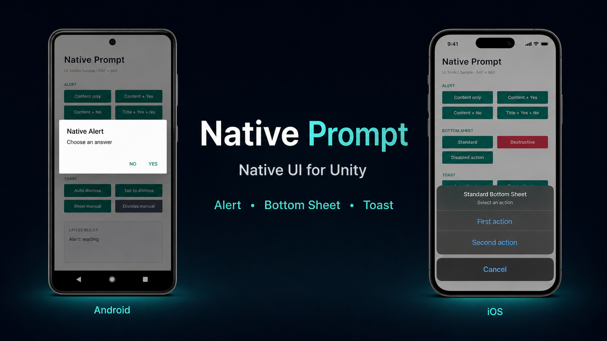
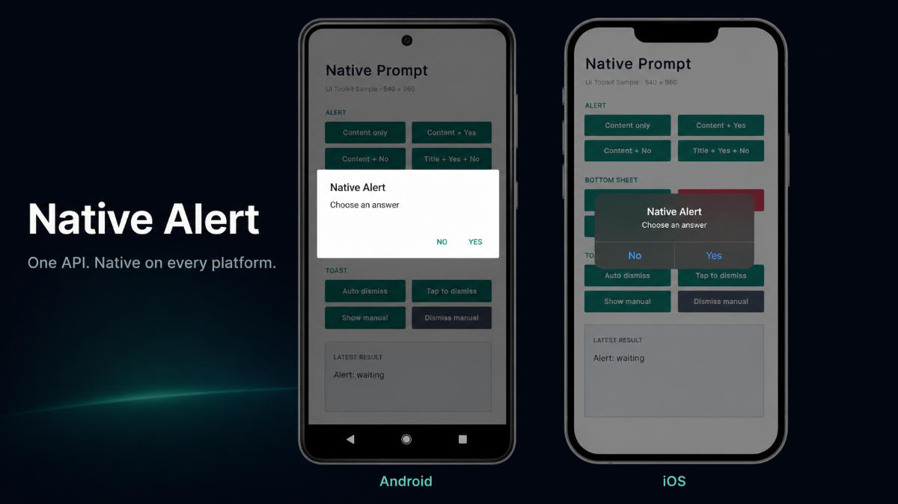
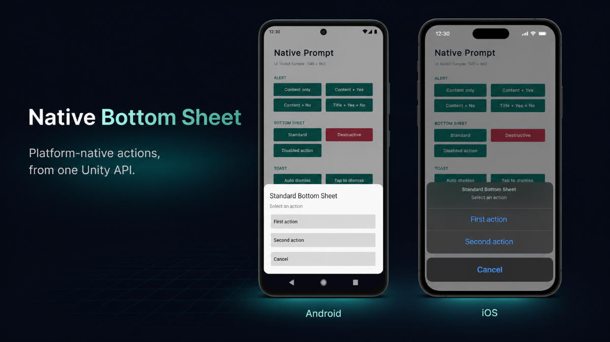
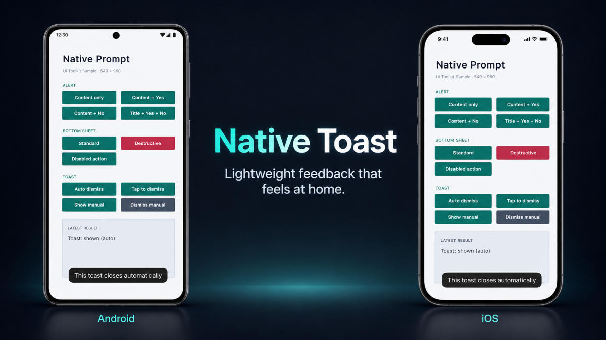
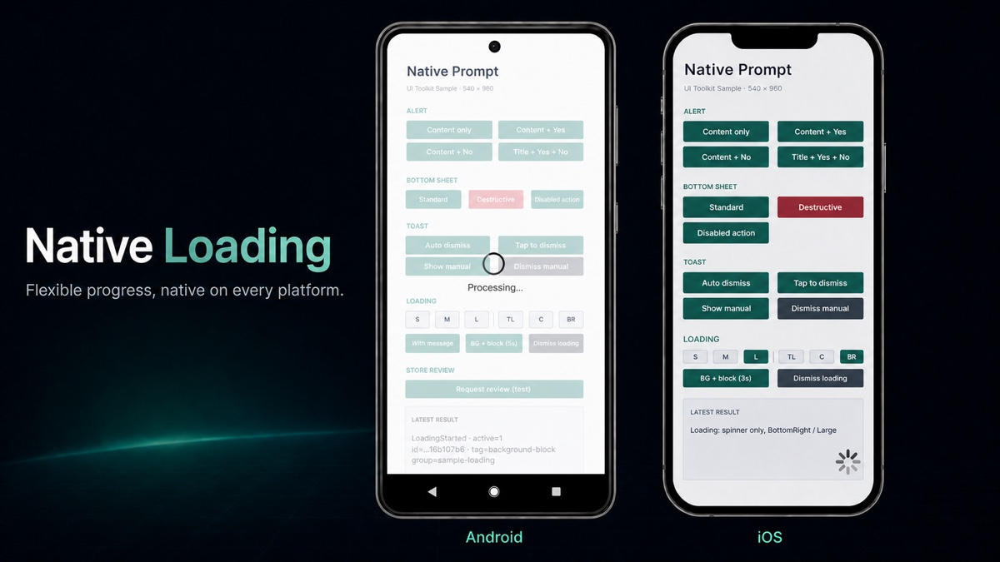

# Native Prompt

Native Prompt is a native UI plugin for Unity. It provides alerts, bottom sheets,
toasts, and loading overlays on iOS and Android through one small C# API.



## Table of Contents

- [Requirements](#requirements)
- [Installation](#installation)
- [Quick Start](#quick-start)
- [Native Alert](#native-alert)
- [Native Bottom Sheet](#native-bottom-sheet)
- [Native Toast](#native-toast)
- [Native Loading](#native-loading)
- [Handles](#handles)
- [Lifecycle Events](#lifecycle-events)
- [Sample Scene](#sample-scene)
- [Documentation](#documentation)
- [License](#license)

## Requirements

- Unity 6000.0 or later
- iOS 13 or later
- Android API level 24 or later

The Android implementation uses Android SDK dialogs and views. It does not require
Material Components, Compose, or another external UI library.

## Installation

The package ID is `com.ishix.nativeprompt`.

To install it with Unity Package Manager:

1. Open **Window > Package Management > Package Manager** in Unity.
2. Select **Install package from git URL** from the add menu.
3. Enter the following URL:

```text
https://github.com/IShix-g/NativePrompt.git?path=/Packages/com.ishix.nativeprompt#v1
```

You can instead add the package directly to your project's
`Packages/manifest.json`:

```json
{
  "dependencies": {
    "com.ishix.nativeprompt": "https://github.com/IShix-g/NativePrompt.git?path=/Packages/com.ishix.nativeprompt#v1"
  }
}
```

## Quick Start

Create a C# script, attach it to a GameObject, and connect `ShowAlert` to a UI
Button's **On Click** event.

```csharp
using NativePrompt;
using UnityEngine;

public sealed class NativePromptQuickStart : MonoBehaviour
{
    public void ShowAlert()
    {
        NP.ShowAlert(
            new AlertOptions
            {
                Title = "Saved",
                Content = "Your changes were saved."
            },
            result => Debug.Log($"Alert result: {result}"))
            .AddTo(this);
    }
}
```

The callback receives the result on the Unity main thread. `AddTo(this)` prevents
the prompt from outliving this component or its scene.

In the Unity Editor, Native Prompt uses utility windows or Console output to make
API flows easy to test. Check final appearance and interaction on an iOS or Android
device.

For common application flows, see [Recipes](docs/recipes.md).

## Native Alert



Use an alert for a confirmation or a short notice. `Content` is required. When Yes
and No are omitted, Native Prompt displays one close button.

```csharp
NP.ShowAlert(
    new AlertOptions
    {
        Title = "Delete save?",
        Content = "This cannot be undone.",
        YesButtonText = "Delete",
        NoButtonText = "Keep"
    },
    result =>
    {
        if (result == AlertResult.Yes)
        {
            DeleteSave();
        }
    })
    .AddTo(this);
```

Alerts are shown one at a time in request order. On Android, the Back button and a
backdrop tap do not close an alert.

See the [Alert API reference](docs/api.md#alert) for all options, results, queue
behavior, and manual dismissal.

## Native Bottom Sheet



Use a bottom sheet to offer one to three actions. Give each action a stable, unique
ID and handle that ID in the callback.

```csharp
NP.ShowBottomSheet(
    new BottomSheetOptions
    {
        Title = "Photo",
        Actions = new[]
        {
            new BottomSheetAction { Id = "share", Text = "Share" },
            new BottomSheetAction
            {
                Id = "delete",
                Text = "Delete",
                Style = BottomSheetActionStyle.Destructive
            }
        }
    },
    result =>
    {
        if (!result.IsCancelled)
        {
            RunPhotoAction(result.ActionId);
        }
    })
    .AddTo(this);
```

A cancel button, backdrop tap, or Android Back returns a cancelled result. Disabled
actions can remain visible without being selectable.

See the [Bottom Sheet API reference](docs/api.md#bottom-sheet) for action options,
result values, validation, and dismissal behavior.

## Native Toast



Use a toast for brief feedback that does not interrupt the current flow.

```csharp
NP.ShowToast(
    new ToastOptions
    {
        Message = "Saved",
        Position = ToastPosition.Bottom
    },
    reason => Debug.Log($"Toast dismissed: {reason}"))
    .AddTo(this);
```

Toasts dismiss automatically after 2.5 seconds by default. Only one toast is
visible at a time; a new toast replaces the previous one. Keep the returned handle
when you disable automatic dismissal and need to close the toast yourself.

See the [Toast API reference](docs/api.md#toast) for duration, tap behavior,
positions, and dismissal reasons.

## Native Loading



Use Loading while an operation such as a purchase or network request is running.
Loading does not end automatically, so keep the returned handle and dismiss it on
every success, failure, and cancellation path.

```csharp
private LoadingHandle _loading;

public void BeginPurchase()
{
    _loading?.Dismiss();
    _loading = NP.ShowLoading(new LoadingOptions
    {
        BlocksInteraction = true,
        ShowsBackground = true,
        Position = LoadingPosition.Center,
        Message = "Processing..."
    }).AddTo(this);
}

public void EndPurchase()
{
    _loading?.Dismiss();
    _loading = null;
}
```

Input blocking and background visibility are separate options. Visual elements
appear after a short delay by default, which avoids flashing the spinner for quick
operations. Multiple loading handles may coexist; the newest active request controls
the shared loading view.

See the [Loading API reference](docs/api.md#loading) for appearance options, delayed
display, overlapping requests, and lifecycle events.

## Handles

Every `Show*()` method returns a handle for that request.

- Call `Dismiss()` to close it and deliver the normal dismissal result.
- Call `Dispose()` to remove Alert, Bottom Sheet, or Toast without a result
  callback or completion event.
- Chain `AddTo(this)` to clean up automatically when the owning `MonoBehaviour` is
  destroyed.
- Use `RequestId`, `Tag`, and `GroupId` to identify a request. Tags and groups are
  metadata; they do not dismiss related prompts automatically.

Both `Dismiss()` and `Dispose()` are safe to call more than once. Loading has no
per-request result callback; `LoadingEnded` reports how its request ended.

```csharp
AlertHandle alert = NP.ShowAlert(new AlertOptions
{
    Content = "Continue?"
}).AddTo(this);

// Close this specific alert later if needed.
alert.Dismiss();
```

See the [Handle lifetime reference](docs/api.md#handle-lifetime) for ownership,
disposal, metadata, and `AddTo` behavior.

## Lifecycle Events

Use the callback passed to `Show*()` when only the caller needs the result. Use
static lifecycle events when another part of the application needs to observe all
prompts of a type.

| UI | Displayed | Finished |
| --- | --- | --- |
| Alert | `NP.AlertOpened` | `NP.AlertCompleted` |
| Bottom Sheet | `NP.BottomSheetOpened` | `NP.BottomSheetCompleted` |
| Toast | `NP.ToastShown` | `NP.ToastDismissed` |
| Loading | `NP.LoadingStarted` | `NP.LoadingEnded` |

Subscribe and unsubscribe with the listener's lifecycle because `NP` events are
static:

```csharp
private void OnEnable()
{
    NP.AlertCompleted += OnAlertCompleted;
}

private void OnDisable()
{
    NP.AlertCompleted -= OnAlertCompleted;
}

private void OnAlertCompleted(object _, AlertCompletedEventArgs args)
{
    Debug.Log($"{args.RequestId}: {args.Result}");
}
```

Callbacks and events run on the Unity main thread. For a completion, the
per-request callback runs before the static event. `LoadingStarted` reports that a
request was accepted, which may be before its delayed spinner becomes visible.

See the [Lifecycle event reference](docs/api.md#lifecycle-events) for event
arguments, metadata, delivery order, Loading counts, and end reasons.

## Sample Scene

In Package Manager, select **Native Prompt**, open the **Samples** tab, and import
**Native Prompt Sample**. Open `NativePromptSample.unity` and enter Play Mode.

The sample includes Alert, Bottom Sheet, Toast, and Loading controls and displays
their latest results. Use the Editor to check API flows, then run the sample on iOS
or Android to check native appearance and interaction.

## Documentation

- [API reference](docs/api.md)
- [Recipes](docs/recipes.md)
- [How NativePrompt works](docs/architecture.md)

## License

This project is licensed under the MIT License. See [LICENSE](LICENSE).
