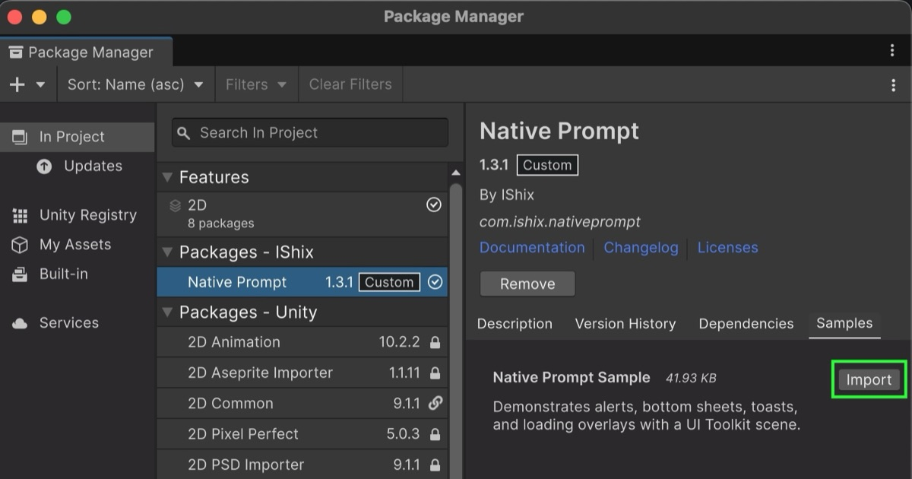
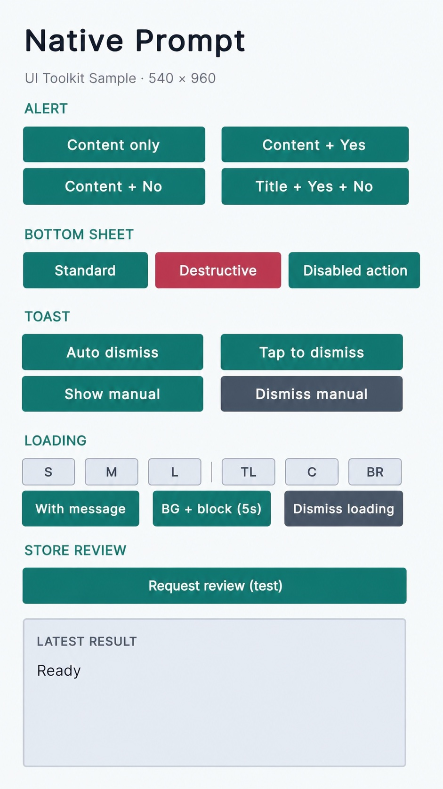
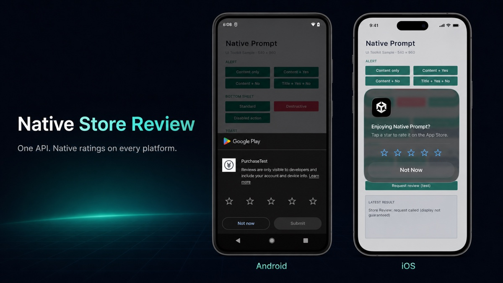

# Native Prompt

Native Prompt is a native UI plugin for Unity. It provides alerts, bottom sheets,
toasts, loading overlays, and in-app review requests on iOS and Android through one
small C# API.


## Table of Contents

- [Requirements](#requirements)
- [Installation](#installation)
- [Quick Start](#quick-start)
- [Unity Editor Preview](#unity-editor-preview)
- [Native Alert](#native-alert)
- [Native Bottom Sheet](#native-bottom-sheet)
- [Native Toast](#native-toast)
- [Native Loading](#native-loading)
- [Store Review](#store-review)
- [Handles](#handles)
- [Lifecycle Events](#lifecycle-events)
- [Sample Scene](#sample-scene)
- [Documentation](#documentation)
- [License](#license)

## Requirements

- Unity 6000.0 or later
- iOS 13 or later
- Android API level 24 or later

The Android prompt UI uses Android SDK dialogs and views. It does not require
Material Components, Compose, or another external UI library. Store Review uses
Google Play In-App Review `com.google.android.play:review:2.0.2`, resolved by the
package's Android Library.

## Installation

The package ID is `com.ishix.nativeprompt`.

To install it with Unity Package Manager:

1. Open **Window > Package Manager** in Unity.
2. Select **Install package from git URL** from the add menu.
3. Enter the following URL:

```text
https://github.com/IShix-g/NativePrompt.git?path=/Packages/com.ishix.nativeprompt#v1
```

You can instead add the package directly to your project's
`Packages/manifest.json`:

```json
{
  "dependencies": {
    "com.ishix.nativeprompt": "https://github.com/IShix-g/NativePrompt.git?path=/Packages/com.ishix.nativeprompt#v1"
  }
}
```

## Quick Start

Start with the included sample to try every API without writing setup code.

1. Open **Window > Package Manager**.
2. Select **Native Prompt**, then open the **Samples** tab.
3. Import **Native Prompt Sample**.



4. Open `Assets/Samples/Native Prompt/{version}/Native Prompt Sample/NativePromptSample.unity`.
5. Enter Play Mode and use the sample controls.



For common application flows, see [Recipes](docs/recipes.md).

## Unity Editor Preview

Alert, Bottom Sheet, Toast, and Loading have interactive, iOS-inspired previews in
the Game view while running in the Unity Editor. Store Review accepts the request
and writes a test log without showing store UI. Preview assets are Editor-only and
loaded through `AssetDatabase`, so they are not included in player builds.

## [Native Alert](docs/api.md#native-alert)


Use an alert for a confirmation or a short notice. `Content` is required. When Yes
and No are omitted, Native Prompt displays one close button.

```csharp
NP.ShowAlert(
    new AlertOptions
    {
        Title = "Delete save?",
        Content = "This cannot be undone.",
        YesButtonText = "Delete",
        NoButtonText = "Keep"
    },
    result =>
    {
        if (result == AlertResult.Yes)
        {
            DeleteSave();
        }
    })
    .AddTo(this);
```

<details>
<summary>Optional: view the Awaitable version</summary>

```csharp
private async Awaitable DeleteSaveWithConfirmationAsync()
{
    AlertResult result = await NP.ShowAlertAsync(
        new AlertOptions
        {
            Title = "Delete save?",
            Content = "This cannot be undone.",
            YesButtonText = "Delete",
            NoButtonText = "Keep"
        },
        destroyCancellationToken);

    if (result == AlertResult.Yes)
    {
        DeleteSave();
    }
}
```

</details>

Alerts are shown one at a time in request order. On Android, the Back button and a
backdrop tap do not close an alert.

See the [Alert API reference](docs/api.md#native-alert) for all options, results,
queue behavior, and manual dismissal.

## [Native Bottom Sheet](docs/api.md#native-bottom-sheet)


Use a bottom sheet to offer one to three actions. Give each action a stable, unique
ID and handle that ID in the callback.

```csharp
NP.ShowBottomSheet(
    new BottomSheetOptions
    {
        Title = "Photo",
        Actions = new[]
        {
            new BottomSheetAction
            {
                Id = "share",
                Text = "Share"
            },
            new BottomSheetAction
            {
                Id = "delete",
                Text = "Delete",
                Style = BottomSheetActionStyle.Destructive
            }
        }
    },
    result =>
    {
        if (!result.IsCancelled)
        {
            RunPhotoAction(result.ActionId);
        }
    })
    .AddTo(this);
```

<details>
<summary>Optional: view the Awaitable version</summary>

```csharp
private async Awaitable ShowPhotoActionsAsync()
{
    BottomSheetResult result = await NP.ShowBottomSheetAsync(
        new BottomSheetOptions
        {
            Title = "Photo",
            Actions = new[]
            {
                new BottomSheetAction
                {
                    Id = "share",
                    Text = "Share"
                },
                new BottomSheetAction
                {
                    Id = "delete",
                    Text = "Delete",
                    Style = BottomSheetActionStyle.Destructive
                }
            }
        },
        destroyCancellationToken);

    if (!result.IsCancelled)
    {
        RunPhotoAction(result.ActionId);
    }
}
```

</details>

A cancel button, backdrop tap, or Android Back returns a cancelled result. Disabled
actions can remain visible without being selectable.

See the [Bottom Sheet API reference](docs/api.md#native-bottom-sheet) for action
options, result values, validation, and dismissal behavior.

## [Native Toast](docs/api.md#native-toast)


Use a toast for brief feedback that does not interrupt the current flow.

```csharp
NP.ShowToast(
    new ToastOptions
    {
        Message = "Saved",
        Position = ToastPosition.Bottom
    },
    reason => Debug.Log($"Toast dismissed: {reason}"))
    .AddTo(this);
```

<details>
<summary>Optional: view the Awaitable version</summary>

```csharp
private async Awaitable ShowSavedToastAsync()
{
    ToastDismissReason reason = await NP.ShowToastAsync(
        new ToastOptions
        {
            Message = "Saved",
            Position = ToastPosition.Bottom
        },
        destroyCancellationToken);

    Debug.Log($"Toast dismissed: {reason}");
}
```

</details>

Toasts dismiss automatically after 2.5 seconds by default. Only one toast is
visible at a time; a new toast replaces the previous one. Keep the returned handle
when you disable automatic dismissal and need to close the toast yourself.

See the [Toast API reference](docs/api.md#native-toast) for duration, tap behavior,
positions, and dismissal reasons.

## [Native Loading](docs/api.md#native-loading)


Use Loading while an operation such as a purchase or network request is running.
Loading does not end automatically, so keep the returned handle and dismiss it on
every success, failure, and cancellation path.

```csharp
private LoadingHandle _loading;

public void BeginPurchase()
{
    _loading?.Dismiss();
    _loading = NP.ShowLoading(new LoadingOptions
    {
        BlocksInteraction = true,
        ShowsBackground = true,
        Position = LoadingPosition.Center,
        Message = "Processing..."
    }).AddTo(this);
}

public void EndPurchase()
{
    _loading?.Dismiss();
    _loading = null;
}
```

Input blocking and background visibility are separate options. Visual elements
appear after a short delay by default, which avoids flashing the spinner for quick
operations. Multiple loading handles may coexist; the newest active request controls
the shared loading view.

At corner positions, the message sits toward the inside of the screen and the
spinner stays on the outside edge. At `Center`, the message appears below the
spinner. Long messages are limited to two lines at corners and four lines at the
center.

See the [Loading API reference](docs/api.md#native-loading) for appearance options,
delayed display, overlapping requests, and lifecycle events.

## [Store Review](docs/api.md#store-review)



Request the platform's in-app rating and review flow after a meaningful, positive
moment in your application:

```csharp
NP.RequestReview();
```

The method has no arguments, result, callback, or handle. Native Prompt never calls
it automatically and does not manage session counts, elapsed days, app versions,
timing, or frequency. The operating system or store may suppress the dialog, so do
not use its display, rating, or submission as part of application control flow.

On iOS, verify the UI with a development build; Store Review requests have no
effect in TestFlight. The review dialog is system-provided: iOS automatically
localizes its standard explanatory text and controls for the device language, and
applications cannot customize that wording. The app name shown in the dialog comes
from the bundle display name. No additional localization is needed when the same app
name is used in every language; applications that need a language-specific app name
can localize `CFBundleDisplayName` in their generated iOS project.

On Android, use a Play Console internal test track or internal app sharing. The
package resolves `com.google.android.play:review:2.0.2` internally; the application
does not need an Android Manifest change, custom Gradle template, App Store ID,
entitlement, capability, or privacy manifest change.

The sample's `Request review (test)` button is for Editor and device verification.
Production apps should choose an appropriate moment automatically rather than make
the system review request a user-facing call-to-action.

## [Handles](docs/api.md#handle-lifetime)

Every `Show*()` method returns a handle for that request.

- Call `Dismiss()` to close it and deliver the normal dismissal result.
- Call `Dispose()` to remove Alert, Bottom Sheet, or Toast without a result
  callback or completion event.
- Chain `AddTo(this)` to clean up automatically when the owning `MonoBehaviour` is
  destroyed.
- Use `RequestId`, `Tag`, and `GroupId` to identify a request. Tags and groups are
  metadata; they do not dismiss related prompts automatically.

Both `Dismiss()` and `Dispose()` are safe to call more than once. Loading has no
per-request result callback; `LoadingEnded` reports how its request ended.

```csharp
AlertHandle alert = NP.ShowAlert(new AlertOptions
{
    Content = "Continue?"
}).AddTo(this);

// Close this specific alert later if needed.
alert.Dismiss();
```

See the [Handle lifetime reference](docs/api.md#handle-lifetime) for ownership,
disposal, metadata, and `AddTo` behavior.

## [Lifecycle Events](docs/api.md#lifecycle-events)

Use the callback passed to `Show*()` when only the caller needs the result. Use
static lifecycle events when another part of the application needs to observe all
prompts of a type.

| UI | Displayed | Finished |
| --- | --- | --- |
| Alert | `NP.AlertOpened` | `NP.AlertCompleted` |
| Bottom Sheet | `NP.BottomSheetOpened` | `NP.BottomSheetCompleted` |
| Toast | `NP.ToastShown` | `NP.ToastDismissed` |
| Loading | `NP.LoadingStarted` | `NP.LoadingEnded` |

For application-wide behavior that should change while any Loading request is
active, use `NP.LoadingStateChanged` and initialize from `NP.IsLoading`:

```csharp
private void OnEnable()
{
    NP.LoadingStateChanged += OnLoadingStateChanged;
    OnLoadingStateChanged(NP.IsLoading);
}

private void OnDisable()
{
    NP.LoadingStateChanged -= OnLoadingStateChanged;
}

private void OnLoadingStateChanged(bool isLoading)
{
    Debug.Log(isLoading ? "Loading started" : "Loading ended");
}
```

Replace the log with application behavior such as muting audio or pausing selected
events. The event runs only when the first Loading starts or the last one ends.

Subscribe and unsubscribe with the listener's lifecycle because `NP` events are
static:

```csharp
private void OnEnable()
{
    NP.AlertCompleted += OnAlertCompleted;
}

private void OnDisable()
{
    NP.AlertCompleted -= OnAlertCompleted;
}

private void OnAlertCompleted(AlertCompletedEventArgs args)
{
    Debug.Log($"{args.RequestId}: {args.Result}");
}
```

Callbacks and events run on the Unity main thread. For a completion, the
per-request callback runs before the static event. `LoadingStarted` reports that a
request was accepted, which may be before its delayed spinner becomes visible.

See the [Lifecycle event reference](docs/api.md#lifecycle-events) for event
arguments, metadata, delivery order, Loading counts, and end reasons.

## Sample Scene

The imported sample includes Alert, Bottom Sheet, Toast, Loading, and Store Review
test controls and displays their latest results. Loading controls cover spinner
sizes, representative positions, a message, background/input blocking, and manual
dismissal. The Store Review result reports only that the request was called. Follow
[Quick Start](#quick-start) to import and open it.

## Documentation

- [API reference](docs/api.md)
- [Recipes](docs/recipes.md)
- [How NativePrompt works](docs/architecture.md)

## License

This project is licensed under the MIT License. See [LICENSE](LICENSE).
